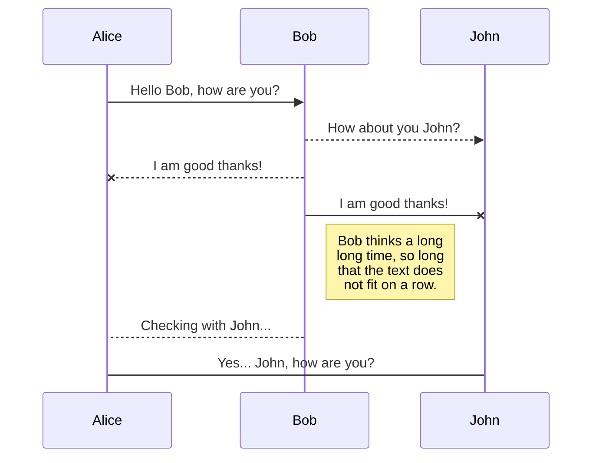
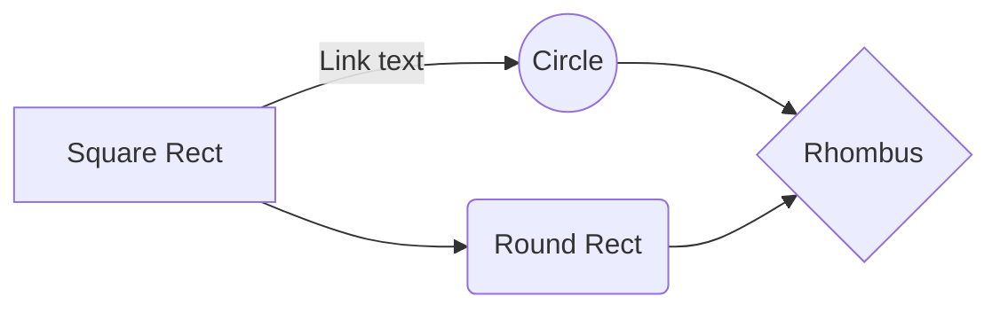

# YNHH Software Development Lifecycle Guidelines

## Overview

The purpose of our Software Development Life Cycle (SDLC) is to create robust, secure, and innovative healthcare-centric software solutions that enhance the quality of patient care, optimize clinical workflows, and empower healthcare providers. Our SDLC framework is designed to guide software engineers in developing cutting-edge applications that adhere to industry standards, regulatory requirements, and best practices in healthcare technology.

By leveraging agile methodologies, user-centered design principles, and rigorous testing protocols, our SDLC ensures the development of software solutions that are efficient, scalable, and seamlessly integrated with existing healthcare systems. Our focus on healthcare-centric themes aims to address the unique challenges and opportunities within the healthcare industry, ultimately contributing to improved patient outcomes, enhanced data security, and streamlined healthcare operations. Through this purpose-driven SDLC, we aim to empower software engineers to make a meaningful impact on the healthcare ecosystem and revolutionize the delivery of healthcare services.

  

## Requirements and Estimations

In our Software Development Life Cycle (SDLC), the process of creating requirements forms the foundation for successful software development. The following step-by-step process helps software engineers effectively gather and define requirements:

  

### Identify Stakeholders:

  

-   Identify the key stakeholders involved in the software development project, such as clients, end-users, product managers, and subject matter experts (SMEs).
    
-   Engage with stakeholders to understand their perspectives, needs, and expectations regarding the software solution.
    
-   Consider the input from stakeholders during the estimation process to ensure realistic expectations.
    

### Conduct Stakeholder Interviews:

  

-   Schedule interviews or workshops with stakeholders to gather requirements.
    
-   Ask open-ended questions to elicit detailed information about the software's functionality, features, and desired outcomes.
    
-   Collaborate with stakeholders to understand their priorities and provide estimations based on the complexity and effort required for each requirement.
    

### Analyze Existing Documentation:

  

-   Review any existing documentation, such as business plans, user manuals, or technical specifications.
    
-   Extract relevant information and identify any gaps or inconsistencies.
    
-   Consider the business processes, regulations, and industry standards that impact the software solution while estimating the time and effort required.
    

### Prioritize and Organize Requirements:

  

-   Classify and prioritize the gathered requirements based on their importance and impact.
    
-   Use techniques like MoSCoW (Must-Have, Should-Have, Could-Have, Won't-Have) or story point estimation to prioritize requirements.
    
-   Organize the requirements into logical categories or themes to ensure comprehensive coverage while estimating the effort for each category.
    

### Define Clear and Measurable Requirements:

  

-   Write clear, concise, and unambiguous requirement statements.
    
-   Use specific language, avoiding ambiguous terms or jargon.
    
-   Ensure each requirement is measurable and testable, enabling effective verification and validation.
    
-   Consider the complexity of each requirement when estimating the time and resources needed for implementation.
    

### Collaborate and Validate Requirements:

  

-   Share the requirements with stakeholders for their review and feedback.
    
-   Facilitate discussions and collaborative sessions to refine and validate the requirements.
    
-   Incorporate feedback from stakeholders, ensuring alignment with their expectations and needs.
    
-   Consider the feedback received while revisiting the estimations to ensure they reflect any changes or adjustments.
    

### Document and Maintain Requirements:

  

-   Document the finalized requirements in a structured format, such as a requirements specification document or user stories.
    
-   Include additional details, such as acceptance criteria, user personas, and use case scenarios, to provide clarity.
    
-   Regularly update and maintain the requirements documentation throughout the software development lifecycle.
    
-   Keep the estimations updated as the requirements evolve or change to maintain accurate estimates.

#### Using Mermaid for Diagrams

##### You can render UML diagrams using [Mermaid](https://mermaidjs.github.io/). For example, this will produce a sequence diagram:

##### This will produce a sequence class or UML diagram:  

TBA

##### This will produce a flow chart:

##### This will produce a Entity Relationship Diagram:

TBA

### Establish Change Management:

  

-   Implement a change management process to handle evolving requirements.
    
-   Define a mechanism for capturing and assessing change requests.
    
-   Evaluate the impact of proposed changes on the project timeline, budget, and existing requirements before incorporating them into the estimation.
    

### Estimate Effort and Time:

  

-   Consider the complexity, dependencies, and potential risks associated with each requirement.
    
-   Break down larger requirements into smaller tasks for more accurate estimation.
    
-   Collaborate with the development team to gather their input on the estimated effort and time required.
    
-   Use estimation techniques like story points, function points, or expert judgment to provide estimations for each requirement.
    

  

## Test Driven Design

  

Test-Driven Development (TDD) is an iterative software development approach that emphasizes writing tests before writing the corresponding code. It promotes better code quality, faster development cycles, and improved maintainability. Here is a step-by-step process for practicing TDD:

### Define Test Cases:

-   Start by identifying the specific functionality or behavior you want to implement.
    
-   Create a set of test cases that encompass different scenarios and cover the desired behavior.
    
-   Each test case should be focused, concise, and test a specific aspect of the functionality.
    

### Write Failing Tests:

-   Begin by writing the test code for the first test case, ensuring it initially fails.
    
-   Use a testing framework or tool that is suitable for the programming language and platform being used.
    
-   Keep the test code simple and straightforward, focusing on the desired behavior.
    

### Run Tests:

-   Execute the test suite to validate that the newly created test(s) fail as expected.
    
-   This confirms that the test is effectively checking for the desired behavior and that the implementation is not yet fulfilling the requirements.
    

### Implement Minimum Code:

-   Write the minimum amount of code necessary to make the failing test(s) pass.
    
-   The implementation should be straightforward and address the requirements of the failing test(s) without considering additional functionality.
    

### Run Tests Again:

-   Rerun the test suite to verify that the previously failing test(s) now pass.
    
-   This ensures that the minimal implementation is correct and aligns with the intended behavior.
    

### Refactor Code:

-   After the test(s) pass, refactor the code to improve its design, readability, and maintainability.
    
-   Apply software engineering best practices and design principles to optimize the code.
    
-   Ensure that the test suite remains intact and passes after each refactoring step.
    

### Repeat the Cycle:

-   Move on to the next test case and repeat the process from step 2 onwards.
    
-   Continue adding more tests, implementing the minimum code required to pass them, and refactoring as necessary.
    
-   This iterative cycle of test, implement, and refactor ensures incremental development while maintaining code integrity.
    

### Continuous Integration and Regression Testing:

-   Integrate the newly developed code into the larger codebase regularly.
    
-   Run the complete test suite, including all previously written tests, to ensure that new changes do not introduce regressions.
    
-   This helps maintain the integrity of the software and prevents the accumulation of technical debt.
    

  

## Source Control with Git and Github

Source control, specifically using Git and GitHub, is an essential part of the Software Development Life Cycle (SDLC) that enables collaboration, version management, and code integrity. The following steps outline a typical source control process for software engineers:

### Initialize Git Repository:

-   Start by initializing a Git repository in the root directory of your project.
    
-   Use the command "git init" to create a local Git repository.
    

### Create Branches:

-   Create a branch for each new feature, bug fix, or task.
    
-   Use meaningful branch names that reflect the purpose of the changes.
    
-   For example, create a branch called "feature/login-page" for developing a login page feature.
    

### Make Commits:

-   Regularly make small, atomic commits as you work on your code.
    
-   Use the command "git add <file>" to stage the changes, followed by "git commit -m 'Commit message'" to commit them.
    
-   Provide descriptive commit messages that summarize the changes made in that commit.
    

### Push Changes:

-   Push your local branch to the remote repository (GitHub) using the command "git push origin <branch-name>".
    
-   This allows others to access your changes and facilitates collaboration.
    

### Pull Requests:

-   Open a pull request (PR) on GitHub to propose changes to the main branch (e.g., "main" or "master").
    
-   Include a detailed description of the changes and reference related issues, if applicable.
    
-   Assign reviewers to provide feedback on the code changes.
    

### Review and Collaborate:

-   Reviewers examine the code changes, provide feedback, and suggest improvements.
    
-   Collaborate with the reviewers through discussions within the PR.
    
-   Address the feedback, make necessary adjustments, and update the code accordingly.
    

### Merge the Pull Request:

-   Once the changes in the PR have been reviewed and approved, merge the branch into the main branch.
    
-   Resolve any conflicts that may arise during the merge process.
    
-   Use the "Merge" or "Squash and Merge" option on GitHub, depending on your team's preferences.
    

### Pull the Latest Changes:

-   Regularly pull the latest changes from the main branch to stay up to date with the latest codebase.
    
-   Use the command "git pull origin <branch-name>" to update your local branch.
    

### Resolve Conflicts:

-   If conflicts occur during the pull process, resolve them by manually modifying the conflicting files.
    
-   Use a diff tool to compare and merge the conflicting sections.
    
-   Once conflicts are resolved, commit the changes and continue with your work.
    

### Tagging and Release:

-   Use Git tags to mark important milestones or releases.
    
-   Tag versions or releases with meaningful labels (e.g., v1.0.0) to track and reference them easily.
    

### Continuous Integration:

-   Integrate source control with a Continuous Integration (CI) system to automate build, test, and deployment processes.
    
-   Configure CI pipelines to trigger on specific events (e.g., branch pushes or PR merges) and execute automated tests.
    

## Refactoring

  

In our Software Development Life Cycle (SDLC), refactoring plays a vital role in continuously improving the quality, maintainability, and extensibility of our software solutions. Refactoring is the disciplined process of restructuring existing code without altering its external behavior, aimed at enhancing its internal design, reducing technical debt, and increasing development efficiency. As software engineers, here's a step-by-step refactoring process to follow:

  

### Identify Areas for Refactoring:

  

-   Analyze the codebase to identify sections that are difficult to understand, error-prone, or violate coding standards.
    
-   Look for duplicated code, long methods, complex conditionals, or poorly named variables and functions.
    

### Define Refactoring Goals:

  

-   Clearly define the objectives of the refactoring effort, such as improving performance, enhancing readability, or simplifying maintenance.
    
-   For example, aim to eliminate code duplication in a module to enhance maintainability and reduce the risk of introducing bugs.
    

### Create Refactoring Plan:

  

-   Break down the refactoring task into smaller, manageable steps.
    
-   Define a clear sequence of transformations to be applied to the code.
    
-   For instance, extract a method from a long and complex function to improve readability and enable reusability.
    

### Ensure Sufficient Test Coverage:

  

-   Before refactoring, ensure that the code has appropriate test coverage.
    
-   Create or update unit tests to cover the functionality affected by the refactoring changes.
    
-   This guarantees that any unintended changes to the behavior are detected early.
    

### Apply Refactoring Techniques:

  

-   Utilize a variety of refactoring techniques, such as extracting methods, consolidating conditionals, or introducing design patterns.
    
-   Apply each refactoring step carefully, ensuring that the code remains functional after each transformation.
    
-   For instance, split a large method into smaller, focused functions to improve readability and enable easier debugging.
    

### Test and Validate:

  

-   After each refactoring step, run the tests to ensure the code still functions correctly.
    
-   Verify that the behavior and output remain consistent with the original code.
    
-   Thoroughly test edge cases and consider involving automated testing tools to catch potential regressions.
    

### Review and Document:

  

-   Collaborate with team members to review the refactored code.
    
-   Seek feedback on the changes made, ensuring that the refactoring aligns with coding standards and team conventions.
    
-   Document the rationale behind each refactoring step, making it easier for future developers to understand and maintain the codebase.
    

### Iterate and Repeat:

  

-   Refactoring is an iterative process, often performed incrementally over time.
    
-   Continuously monitor the codebase for areas that could benefit from refactoring.
    
-   Regularly revisit the refactored code to identify further opportunities for improvement.
    

  

By following this refactoring process, software engineers can systematically improve the quality, readability, and maintainability of the codebase, leading to more efficient development processes and higher-quality software products.

## UI Design System Guidelines

### Design Principles:

1.  Material: Embrace the core principles of Material Design, such as depth, motion, and meaningful transitions, to create a tactile and realistic user interface.
    
2.  Consistency: Maintain consistent usage of Material UI components and design patterns throughout our applications, ensuring familiarity and ease of use for users.
    
3.  Simplicity: Prioritize simplicity and clarity in our designs, using clean lines, minimalistic elements, and intuitive interactions to enhance usability.
    
4.  Accessibility: Adhere to accessibility guidelines and make our applications inclusive and usable by a diverse range of users, considering color contrast, keyboard navigation, and assistive technologies.
    
5.  Responsiveness: Design responsive interfaces that adapt seamlessly to various screen sizes and devices, providing a consistent experience across mobile, laptop, and tablet platforms.
    

### Component Library:

Our Design System provides a comprehensive library of Material UI components, carefully tailored to fit our application needs. These components include but are not limited to:

-   Buttons
    
-   Cards
    
-   Forms and inputs
    
-   Navigation bars and menus
    
-   Dialogs and modals
    
-   Typography styles
    
-   Icons and imagery
    
-   Data tables
    
-   Grid layouts
    

## Design Guidelines:

To ensure consistent implementation and usage of our Design System, the following guidelines are provided:

### Sizing for Different Devices:

-   Mobile: Optimize the interface for mobile devices by ensuring touch-friendly interactions, legible typography, and appropriately sized components to accommodate smaller screens.
    
-   Laptop/Desktop: Design the interface to leverage the larger screen real estate by utilizing responsive layouts, expanded content, and enhanced navigation options.
    
-   Tablet: Provide a seamless experience on tablets by adapting the interface to the intermediate screen size, considering touch interactions and efficient use of space.
    

### Typography:

-   Font Family: Utilize the recommended Material UI font families, such as Roboto for general text and display purposes, to maintain consistency across the application.
    
-   Font Sizes: Specify appropriate font sizes for different content types, ensuring readability and visual hierarchy across various devices. For example, headings may have larger font sizes compared to body text.
    
-   Responsive Scaling: Implement responsive font scaling techniques to ensure legibility and optimal readability across different screen sizes, adjusting font sizes proportionally.
    

### Color Palette:

-   Utilize the YNHH color palette, including primary, secondary, and accent colors, to maintain consistency and reinforce the visual language of our Design System.
    
-   Consider color contrast ratios to ensure accessibility, especially for text and interactive elements.
    

### Spacing and Layout:

-   Define consistent spacing values and layout guidelines for margins, padding, and grid systems, following Material UI's spacing recommendations.
    
-   Specify responsive grid systems to adapt layouts and component placement based on the screen size, promoting a harmonious visual flow.
    

### Design System Maintenance:

Our Design System is a living entity that evolves with user feedback, technology advancements, and changing business requirements. Regular maintenance activities include:

  

-   Periodic reviews: Evaluate and update components, patterns, and guidelines to reflect changes in Material UI standards and address emerging design needs.
    
-   Version control: Utilize version control systems to manage updates, track changes, and ensure proper implementation of the latest Design System version in projects.
    
-   Collaboration and feedback: Encourage designers, developers, and other stakeholders to actively contribute feedback, suggestions, and improvements to enhance the Design System's effectiveness.
    
-   Training and documentation: Provide comprehensive training
    

  

## Putting it All Together with Developer Dan

  

### Stage 1: Requirements Gathering and Design

  

- Developer Dan engages in discussions with stakeholders, including the Product Owner and UX designer, to gather requirements and discuss design considerations for the React application.

- He actively listens to stakeholders' needs, asks clarifying questions, and takes detailed notes to ensure a comprehensive understanding of the project requirements.

  

#### Thoughts: 
"The stakeholders' input is crucial in shaping the application's requirements and design. By actively listening and taking detailed notes, I can ensure that we capture their vision accurately and align our technical decisions accordingly."

  

#### Dialog with Stakeholders:

**Stakeholder:** "Dan, I'd like to know when we can expect the new feature to be ready for testing. We have a tight deadline to meet."

  

**Developer Dan:** "I understand the urgency, and I appreciate your concern. To ensure that we deliver a high-quality feature, it's important to allocate sufficient time for development, testing, and any necessary iterations."

  

**Stakeholder:** "I understand the need for quality, but can we speed up the process?"

  

**Developer Dan:** "While I empathize with the need to meet the deadline, it's important to balance speed with quality. Rushing through the development and testing phases can lead to undetected bugs and issues, which could have a negative impact on the user experience and ultimately delay the project further."

  

**Stakeholder:** "I see your point. How can we ensure that we meet the deadline without compromising quality?"

  

**Developer Dan:** "To optimize our timeline, we can focus on efficient task estimation, task prioritization, and streamlining our development process. By breaking down the work into manageable tasks, estimating their effort accurately, and following agile principles, we can make the most of our available time while maintaining a high level of quality."

  

**Stakeholder:** "That makes sense. Let's allocate enough time for testing and ensure that we prioritize critical features. By doing so, we can strike a balance between meeting the deadline and delivering a reliable product."

  

**Developer Dan:** "Thank you for understanding. By prioritizing quality and effective communication, we can work together to achieve the best possible outcome."

  
  

### Stage 2: Task Estimation and Backlog Refinement

  

- Developer Dan collaborates with the development team, including the Scrum Master and fellow engineers, to estimate the effort required for each task and refine the backlog.

- He participates in sprint planning sessions, where the team collectively determines task priorities and breaks them down into actionable user stories.

  

#### Thoughts: 
"Collaborating with the team during task estimation is crucial to ensure realistic timelines and feasible workloads. By leveraging the expertise of my peers, we can distribute tasks effectively and plan for efficient delivery."

  

#### Dialog in a Team Meeting:

**Scrum Master:** "Let's review the user stories in the backlog and estimate their relative effort. Dan, how much effort do you think it will take to implement the user authentication functionality?"

**Dan:** "Based on similar authentication implementations I've worked on before, I estimate it will take approximately two sprints to cover all the necessary features and edge cases."

**Fellow Engineer:** "That seems reasonable. We can also leverage existing authentication libraries to expedite the development process."

  
  

### Stage 3: Test-Driven Development (TDD)

  

- Developer Dan follows a Test-Driven Development (TDD) approach, writing failing unit tests before implementing the corresponding code.

- He collaborates with the Quality Assurance (QA) team to define test scenarios and ensure comprehensive test coverage.

  

#### Thoughts: 
"Adopting a TDD approach helps me validate the correctness of my code and ensures that it aligns with the specified requirements. By involving the QA team early on, we can design test cases that cover both functional and non-functional aspects of the application."

  

### Stage 4: Source Control and Version Management

  

- Developer Dan initializes a Git repository and establishes best practices for source control, including creating feature branches for different development tasks.

- He collaborates with the team to define a branching and merging strategy that ensures code integrity and facilitates seamless collaboration.

  

#### Thoughts:

"Source control is essential for effective collaboration and version management. By using Git and feature branches, we can work on separate tasks simultaneously and merge changes seamlessly while minimizing conflicts."

  

#### Dialog:

  

**Developer Dan:** "Hey team, let's discuss our source control practices and the importance of using feature branches. By leveraging feature branches, we can work on different features or bug fixes independently and reduce the chances of conflicts."

  

**Team Member 1:** "Why can't we just work on the main branch directly?"

  

**Developer Dan:** "Working directly on the main branch can lead to conflicts and impact the stability of the codebase. Feature branches provide isolation, allowing us to work on our respective tasks without interfering with each other. It also enables us to collaborate more effectively by facilitating code reviews and ensuring that changes are thoroughly tested before merging."

  

**Team Member 2:** "How does the pull request process work?"

  

**Developer Dan:** "When we're ready to merge our changes into the main branch, we create a pull request. This triggers a code review where team members can provide feedback on the proposed changes. The code review helps ensure code quality and adherence to our coding standards. Once the pull request is approved, it can be merged into the main branch."

  

#### Thoughts:
 "By discussing source control practices and emphasizing the use of feature branches, we foster a collaborative and organized development process. The pull request workflow enables efficient code reviews and helps maintain the integrity of our codebase."

### Stage 5: Refactoring and Code Quality

- Developer Dan regularly reviews the codebase and performs refactoring to improve code quality, readability, and maintainability.

- He utilizes linting tools, such as ESLint, to enforce coding standards and identify potential issues.

  

#### Thoughts: 
"Maintaining clean and readable code is essential for long-term maintainability. By regularly reviewing and refactoring our code, we can reduce technical debt and enhance the overall quality of the application."

  

#### Dialog:

  

**Younger Developer:** "Hey Dan, I noticed that the code in this module could benefit from some refactoring. It's becoming difficult to understand and maintain. Can we refactor it together?"

  

**Developer Dan:** "Absolutely! It's great that you've identified the need for refactoring. It's an important practice to improve the code quality and maintainability. Let's dive in and see how we can enhance this module."

  

**Younger Developer:** "I think one of the main issues is that this function has grown too long and contains multiple responsibilities. It's becoming hard to follow the logic and make changes without breaking something."

  

**Developer Dan:** "You're right. Long and complex functions can indeed be challenging to work with. To address this, we can start by extracting smaller functions with specific responsibilities. This will make the code more modular and easier to understand."

  

**Younger Developer:** "That sounds like a good approach. Should we create separate functions for each task this function is performing?"

  

**Developer Dan:** "Exactly! We can identify the distinct tasks performed by this function and extract them into separate functions. This way, each function will have a single responsibility, making the code more readable and maintainable."

  

**Younger Developer:** "Got it. I'll start by identifying the tasks and breaking them down into smaller functions. Once we have those, we can refactor this main function to call these smaller functions instead."

  

**Developer Dan:** "That's a great plan. While refactoring, let's also ensure that our code follows best practices, such as using meaningful variable and function names, adding comments where necessary, and adhering to our coding style guidelines."

  

**Younger Developer:** "Definitely. By following these best practices, we can enhance the overall quality of the codebase and make it easier for future developers to work on it."

  

#### Thoughts: 
"Working collaboratively with the younger developer on code refactoring is a great opportunity for knowledge sharing. By guiding them through the process and discussing best practices, we not only improve the code but also help them grow as a developer."

  
  

### Stage 6: Continuous Integration/Continuous Deployment (CI/CD)

  

- Developer Dan discusses the CI/CD setup and deployment strategy

  

with the team in regular team meetings.

- He collaborates with DevOps engineers or the project manager to configure the CI/CD pipeline using tools like Jenkins or Azure DevOps.

  

Thoughts: "Implementing a CI/CD pipeline streamlines our development workflow and allows us to catch issues early on. By automating build, test, and deployment processes, we can maintain code quality and deliver updates more efficiently."

  

During team meetings, Developer Dan discusses progress, resolves any blockers, and aligns the team's efforts towards achieving project goals. The dialogues with stakeholders, as mentioned earlier, occur primarily during the requirements gathering and design stages, where he seeks clarification and ensures that their expectations are captured accurately.

  
  
  

## Glossary of Terms

  

**User-Centered Design:**
    

An approach to design that emphasizes understanding and addressing the needs, preferences, and behaviors of the end users. It involves involving users throughout the design process, conducting user research, and iterating designs based on user feedback.
    

**Material Design:**
    

A design system created by Google that provides guidelines, components, and patterns for designing consistent and visually appealing user interfaces. It focuses on principles like materiality, bold colors, responsive layouts, and subtle animations to create intuitive and engaging experiences.
    

**Code Smells:**
    

Indications of potential design or implementation issues in the codebase. Code smells are patterns or practices that may indicate poor design, inefficiency, or potential bugs. Recognizing and addressing code smells is important for maintaining clean and maintainable code.
    

**Static Code Analysis:**
    

The process of analyzing source code without executing it to identify potential issues, such as coding errors, vulnerabilities, or violations of coding standards. Static code analysis tools automatically scan the codebase to provide feedback and suggestions for improvement.
    

**Technical Debt:**
    

 A metaphorical term referring to the consequences of taking shortcuts or making trade-offs in the development process. Technical debt accumulates when developers choose quick and easy solutions that may require future refactoring or fixing. It represents the effort needed to address these shortcomings in the future.
    

**Style Guides:**
    

A set of predefined guidelines and rules that define the preferred coding style, conventions, and standards for a particular programming language or framework. Style guides help maintain consistency in the codebase and improve code readability and maintainability.
    

**Wireframes:**
    
  Simplified visual representations of a user interface that outline the structure and layout of the elements without focusing on visual details. Wireframes are used to communicate and validate the basic structure and flow of the interface before moving into detailed design.
    
**Prototyping:**
    

The process of creating interactive and functional representations of a software product or system before its full development. Prototypes allow stakeholders to experience and provide feedback on the product's functionality, user interface, and user experience before investing significant resources into development.
    

**Technical Documentation:**
    
Written documentation that provides information about the technical aspects of a software product, such as its architecture, APIs, configuration, and usage guidelines.

It helps developers understand and work with the software effectively and serves as a reference for future maintenance and updates.
    

**Stakeholders:**
    

Individuals or groups who have a vested interest in the software development project.
    
Stakeholders can include end users, product owners, project managers, business analysts, designers, and other team members involved in the development process.
    
Effective stakeholder management ensures alignment, collaboration, and the successful delivery of the project.
    

  

**Red-Green Testing:**
    

A test-driven development (TDD) practice where developers start by writing a failing test (red) that verifies a desired behavior or feature. The test fails initially because the corresponding functionality doesn't exist yet.
    
Developers then proceed to write the minimum amount of code necessary to make the test pass (green), ensuring that the desired behavior is implemented correctly.
    
The red-green cycle continues as developers write additional tests and code to cover all desired features, continuously verifying and improving the software's behavior and functionality.
    
This iterative approach helps ensure that the software meets the specified requirements and maintains desired behavior throughout the development process.
